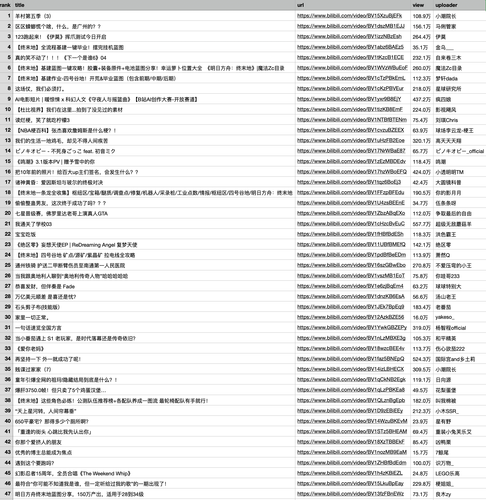

# B站热门视频排行榜抓取工具

一个简单易用的 B 站热门视频数据抓取工具，自动获取全站热门视频 Top 50，并导出为 CSV 和 Markdown 表格格式。

## 功能特性

- 🎯 **自动抓取**：一键获取 B 站全站热门视频 Top 50
- 📊 **双格式导出**：同时生成 CSV（Excel友好）和 Markdown 表格
- 📝 **完整信息**：包含排名、标题、链接、播放量、UP主、视频简介
- 📅 **日期标识**：文件名自动包含日期，便于归档和对比
- 🔢 **智能格式化**：播放量自动转换为"万"、"亿"单位
- 🧹 **自动清理**：智能处理特殊字符和换行符

## 数据字段

| 字段 | 说明 | 备注 |
|------|------|------|
| 排名 | 热门榜单排名 | 1-50 |
| 标题 | 视频标题 | 完整标题 |
| 链接 | 视频链接 | 可点击跳转 |
| 播放量 | 视频播放次数 | 已格式化（如"123.5万"） |
| UP主 | UP主昵称 | 完整名称 |
| 简介 | 视频简介 | CSV完整显示，Markdown限制100字符 |

## 安装依赖

```bash
pip install -r requirements.txt
```

或手动安装：

```bash
pip install requests==2.31.0
```

## 使用方法

### 快速开始

```bash
# 进入项目目录
cd bilibili-hot-videos

# 执行抓取脚本
python scripts/fetch_bilibili_hot.py
```

### 输出文件

执行后会生成两个文件（文件名包含日期）：

- `bilibili_hot_videos-YYYY-MM-DD.csv` - CSV格式，可用Excel打开
- `bilibili_hot_videos-YYYY-MM-DD.md` - Markdown表格，可直接查看

## 示例输出

### 实际输出截图



### Markdown表格示例

| 排名 | 标题 | 链接 | 播放量 | UP主 | 简介 |
|------|------|------|--------|------|------|
| 1 | 羊村第五季（3） | [链接](https://...) | 111.3万 | 小潮院长 | 羊村5来啦！！大活真的真的太不容易了... |
| 2 | 【终末地】全流程基建一键毕业！ | [链接](https://...) | 36.3万 | 金乌___ | 要累死了 终末地基建... |

### CSV文件示例

```csv
rank,title,url,view,uploader,description
1,羊村第五季（3）,https://www.bilibili.com/video/BV15XzuBjEFk,111.3万,小潮院长,"羊村5来啦！！大活真的真的太不容易了，会加快更新，希望观众老爷喜欢本系列！..."
```

## 注意事项

- 本工具使用 B 站官方 API 获取数据，请合理使用
- 播放量数据已自动格式化，方便阅读
- Markdown 表格中的简介限制为 100 字符，避免表格过宽
- CSV 文件包含完整的简介内容
- 建议不要频繁调用，避免给 B 站服务器造成压力

## 文件结构

```
bilibili-hot-videos/
├── README.md                          # 项目说明文档
├── SKILL.md                           # Skill 使用指南
├── requirements.txt                   # Python 依赖
├── assets/
│   └── example-output.png            # 示例输出截图
└── scripts/
    └── fetch_bilibili_hot.py         # 抓取脚本
```

## 依赖说明

- `requests==2.31.0` - HTTP 请求库

## 开发说明

本项目基于 Skill 框架开发，可作为独立工具使用或集成到其他系统中。

### 修改获取数量

默认获取 Top 50，如需修改，编辑 `scripts/fetch_bilibili_hot.py`：

```python
# 修改 API URL 中的 ps 参数
full_url = f"{url}?ps=50&pn=1"  # 将50改为你需要的数量
```

## License

MIT License

## Star History

如果这个工具对你有帮助，欢迎给个 Star ⭐

---

**注意**：本工具仅用于学习和研究目的，请勿用于商业用途。请遵守 B 站的用户协议和机器人协议。
